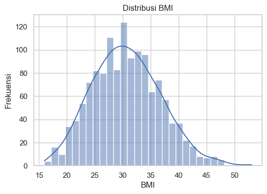
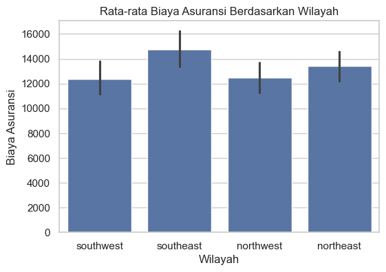
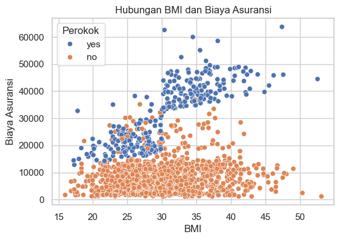
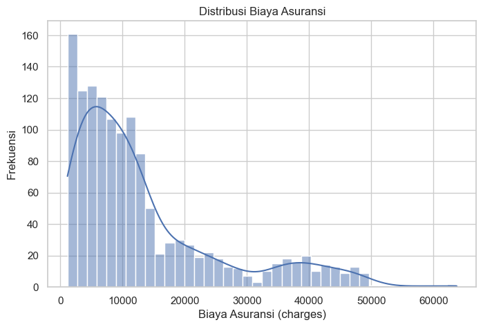

# Laporan Proyek Machine Learning -  Dary Ramadhan Abdussalam
## Domain Proyek

Asuransi kesehatan di Indonesia menghadapi tantangan besar, terutama dalam pengelolaan klaim biaya perawatan. Jaminan Kesehatan Nasional (JKN) yang dikelola oleh BPJS Kesehatan kini mencakup mayoritas penduduk, namun banyaknya klaim menyebabkan defisit keuangan signifikan (Bramastya & Sari, 2024). Untuk menjamin keberlanjutan pembiayaan, dibutuhkan perhitungan klaim yang akurat agar premi sesuai dengan risiko dan anggaran dapat direncanakan lebih baik (Utami & Arifin, 2022; Bramastya & Sari, 2024). Penelitian global menunjukkan bahwa teknik regresi berbasis machine learning dapat memprediksi biaya kesehatan dengan akurasi tinggi menggunakan data demografi dan klinis pasien (Kumar & Lee, 2021).

### Manfaat Prediksi Biaya Asuransi

Memprediksi biaya klaim memiliki beberapa manfaat penting:

* **Penetapan premi yang adil**: Model prediksi mampu memperkirakan besaran klaim mendatang berdasarkan faktor risiko individu (usia, penyakit bawaan, gaya hidup) sehingga tarif premi dapat disesuaikan dengan risiko sebenarnya (Utami & Arifin, 2022).
* **Manajemen anggaran dan risiko**: Estimasi biaya akurat membantu perusahaan asuransi atau pemerintah merencanakan alokasi dana kesehatan dan mengurangi potensi defisit anggaran (Bramastya & Sari, 2024).
* **Deteksi anomali klaim**: Perbedaan signifikan antara prediksi dan realisasi klaim dapat diidentifikasi sebagai indikasi potensi penipuan atau kesalahan pencatatan (Benson & Campbell, 2023).
* **Pengembangan intervensi kesehatan**: Hasil prediksi dapat digunakan untuk merancang program pencegahan dini bagi kelompok berisiko tinggi, sehingga mengurangi beban penyakit kronis di masyarakat (Kumar & Lee, 2021).

### Pendekatan Regresi

Untuk masalah prediksi biaya yang bersifat nilai kontinu, metode regresi (misalnya regresi linier, pohon keputusan, random forest, atau gradient boosting) sangat sesuai (Kumar & Lee, 2021; Benson & Campbell, 2023). Model regresi mempelajari hubungan antara fitur pasien (usia, jenis kelamin, indeks massa tubuh, kebiasaan merokok, dll.) dan total biaya kesehatan (Utami & Arifin, 2022). Penelitian sebelumnya menunjukkan bahwa algoritma regresi ensemble mampu menangkap pola kompleks pada data klaim kesehatan, sehingga menghasilkan prediksi yang lebih akurat dibanding metode tradisional (Benson & Campbell, 2023; Kumar & Lee, 2021). Dengan demikian, proyek ini akan menerapkan berbagai teknik regresi untuk membangun model prediktif biaya asuransi, guna meningkatkan efisiensi finansial sistem asuransi kesehatan (Bramastya & Sari, 2024).

## Business Understanding

Pada bagian ini, dijelaskan proses klarifikasi masalah yang akan diselesaikan melalui pendekatan regresi berbasis machine learning dalam konteks prediksi biaya klaim asuransi kesehatan di Indonesia.

### Problem Statements

Masalah utama yang melatarbelakangi proyek ini adalah sebagai berikut:

* **Pernyataan Masalah 1**
  Defisit anggaran pada program Jaminan Kesehatan Nasional (JKN) yang diselenggarakan oleh BPJS Kesehatan disebabkan oleh ketidakmampuan dalam memperkirakan biaya klaim secara akurat berdasarkan profil risiko peserta.

* **Pernyataan Masalah 2**
  Ketidakpastian dalam menentukan premi asuransi yang proporsional menyebabkan premi yang tidak sesuai dengan risiko, sehingga mengganggu stabilitas finansial sistem asuransi nasional.

* **Pernyataan Masalah 3**
  Kesulitan dalam mengidentifikasi faktor-faktor risiko yang secara signifikan mempengaruhi biaya klaim kesehatan, sehingga pengembangan intervensi kesehatan preventif tidak efektif dan efisien.

### Goals

Tujuan dari proyek ini yang berfokus pada masing-masing pernyataan masalah di atas adalah:

* **Jawaban Pernyataan Masalah 1**
  Mengembangkan model prediksi berbasis machine learning dengan pendekatan regresi untuk memperkirakan biaya klaim secara tepat berdasarkan karakteristik peserta, sehingga membantu BPJS Kesehatan mengelola anggaran secara efektif.

* **Jawaban Pernyataan Masalah 2**
  Menghasilkan rekomendasi premi asuransi yang lebih akurat dan adil melalui prediksi biaya klaim yang mencerminkan risiko individu berdasarkan data demografi, gaya hidup, dan parameter kesehatan peserta.

* **Jawaban Pernyataan Masalah 3**
  Mengidentifikasi dan mengevaluasi fitur-fitur yang paling berpengaruh terhadap besaran biaya klaim, sehingga hasil ini dapat digunakan untuk merancang intervensi kesehatan preventif yang lebih efektif, khususnya bagi kelompok risiko tinggi.

Untuk mencapai tujuan yang telah dijelaskan, proyek ini mengusulkan dua pendekatan solusi yang dapat diukur secara objektif dengan metrik evaluasi seperti MAE, RMSE, dan R².

#### Solution Statement 1: Evaluasi Beberapa Algoritma Regresi

Proyek ini menggunakan tiga algoritma berbeda:

* **Linear Regression** sebagai baseline model yang sederhana dan cepat.
* **Random Forest Regression** sebagai model ensemble berbasis pohon untuk menangani relasi non-linear.
* **Gradient Boosting Regression** sebagai model yang menggabungkan banyak pohon kecil untuk meningkatkan akurasi.

Setiap algoritma dibandingkan berdasarkan performanya menggunakan metrik evaluasi yang sama. Pendekatan ini membantu dalam mengidentifikasi model terbaik dengan performa paling stabil dan akurat.

#### Solution Statement 2: Eksperimen Subset Fitur

Model juga dievaluasi dengan menggunakan tiga subset fitur berbeda:

* **Fitur numerik saja**: untuk melihat performa dasar dari fitur kuantitatif.
* **Fitur dengan korelasi kuat**: untuk menyederhanakan model tanpa mengorbankan banyak informasi.
* **Seluruh fitur hasil encoding**: untuk memanfaatkan semua informasi termasuk kategorikal.

## Data Understanding

Dataset diambil dari [kaggle.com/mirichoi0218/insurance](https://www.kaggle.com/datasets/mirichoi0218/insurance), terdiri dari 1338 sampel dengan fitur-fitur berikut:

* age: usia pemegang polis
* sex: jenis kelamin
* bmi: indeks massa tubuh
* children: jumlah tanggungan anak
* smoker: status perokok
* region: wilayah tempat tinggal
* charges: biaya klaim asuransi (target)

Mayoritas berada di rentang 25–35, menunjukkan bahwa sebagian besar peserta berada pada kondisi overweight. BMI dapat dijadikan indikator risiko dalam prediksi biaya kesehatan.

Wilayah southeast memiliki rata-rata biaya tertinggi, sementara northeast dan northwest lebih rendah. Wilayah geografis dapat memengaruhi biaya asuransi (mungkin karena perbedaan biaya layanan kesehatan atau prevalensi penyakit).

Untuk non-perokok, hubungan BMI dan charges tidak terlalu kuat, Untuk perokok, terlihat pola bahwa semakin tinggi BMI, semakin tinggi biaya klaim. Ada interaksi antara variabel bmi dan smoker. Ini berpotensi dijadikan fitur interaksi dalam model.

Grafik di atas menunjukkan bahwa distribusi biaya asuransi (charges) bersifat right-skewed, artinya sebagian besar individu memiliki biaya yang relatif rendah, sementara sebagian kecil memiliki biaya sangat tinggi (outlier).

## Data Preparation

Tahapan data preparation mencakup seluruh proses pembersihan, transformasi, dan encoding data sebelum digunakan dalam pelatihan model. Berikut langkah-langkah yang dilakukan:

1. **Pemisahan Fitur dan Target**
   Data dipisahkan menjadi fitur independen (X) dan target (y), di mana kolom 'charges' digunakan sebagai target atau variabel dependen.

2. **Encoding Fitur Kategorikal**

   * Kolom `region` yang memiliki empat kategori dikonversi menggunakan Label Encoding agar dapat direpresentasikan dalam bentuk numerik.
   * Fitur `sex` dan `smoker`, yang merupakan kategorikal biner, dikonversi menggunakan One-Hot Encoding dengan opsi `drop='first'` untuk menghindari multikolinearitas.

3. **Normalisasi/Standardisasi Data**
   Seluruh fitur numerik (termasuk hasil encoding) distandarisasi menggunakan `StandardScaler` dari scikit-learn. Ini dilakukan untuk memastikan semua fitur berada dalam skala yang sebanding agar model machine learning, khususnya yang sensitif terhadap skala (seperti regresi linear), dapat bekerja dengan optimal.

4. **Pembentukan Dataset Final**
   Setelah encoding dan scaling, seluruh fitur digabung menjadi satu DataFrame baru. Data kemudian dibagi menjadi data latih dan data uji dengan proporsi 80:20 menggunakan fungsi `train_test_split`, dengan parameter `random_state` ditetapkan agar hasil eksperimen dapat direproduksi.

5. **Eksperimen Subset Fitur**
   Untuk keperluan eksperimen, data juga disiapkan dalam tiga subset berbeda:

   * Hanya fitur numerik: `age`, `bmi`, `children`, `region`
   * Fitur dengan korelasi kuat terhadap target: `age`, `bmi`, `smoker_yes`
   * Seluruh fitur hasil preprocessing (gabungan semua fitur numerik dan kategorikal encoded)

Seluruh proses ini dilakukan secara sistematis dan berurutan untuk memastikan kualitas data yang konsisten dan optimal untuk pelatihan model regresi.

Langkah-langkah preprocessing meliputi:

* Label Encoding untuk fitur 'region'
* One-Hot Encoding untuk fitur kategorikal biner: 'sex' dan 'smoker' (drop='first')
* StandardScaler untuk fitur numerik dan hasil encoding agar skala fitur seragam
* Split data 80:20 untuk training dan testing
* Pengecekan duplicate value dan juga missing value

## Modeling

Tahapan ini membahas mengenai model machine learning yang digunakan untuk menyelesaikan permasalahan. Tiga algoritma regresi digunakan dalam eksperimen ini, yaitu:

1. Linear Regression
2. Random Forest Regressor
3. Gradient Boosting Regressor

Masing-masing model dilatih dan diuji menggunakan tiga subset fitur berbeda: (1) fitur numerik saja, (2) fitur dengan korelasi kuat, dan (3) seluruh fitur yang telah diencoding dan diskalakan. Seluruh model menggunakan parameter default dari pustaka scikit-learn tanpa tuning lanjutan.

Setiap model memiliki karakteristik tersendiri:

1. Linear Regression sederhana dan interpretatif, namun kurang mampu menangkap hubungan non-linear.
2. Random Forest Regressor menangani non-linearitas dengan baik dan relatif tahan terhadap overfitting, namun cenderung memiliki kompleksitas model yang tinggi.
3. Gradient Boosting Regressor unggul dalam mempelajari hubungan kompleks dalam data dan menghasilkan performa prediksi yang lebih baik, meskipun membutuhkan waktu pelatihan lebih lama dan tuning yang lebih hati-hati.

Berdasarkan evaluasi terhadap ketiga subset fitur, Gradient Boosting Regressor dengan seluruh fitur memberikan hasil terbaik dan dipilih sebagai model final karena mencapai keseimbangan antara akurasi dan generalisasi.

## Evaluation

Metrik evaluasi yang digunakan meliputi:

Evaluasi dilakukan untuk menilai sejauh mana model dapat memprediksi nilai biaya klaim asuransi secara akurat. Tiga metrik utama digunakan dalam evaluasi model regresi ini:

1. **Mean Absolute Error (MAE)**
   MAE mengukur rata-rata absolut dari perbedaan antara nilai aktual dan nilai prediksi. Metrik ini memberikan gambaran umum seberapa besar kesalahan prediksi dalam satuan yang sama dengan target (yaitu, biaya klaim). Semakin kecil nilai MAE, semakin baik model dalam melakukan prediksi.

   Formula:
   MAE = (1/n) \* Σ|y\_i - ŷ\_i|

2. **Root Mean Squared Error (RMSE)**
   RMSE mengukur akar dari rata-rata kuadrat kesalahan antara nilai aktual dan prediksi. RMSE lebih sensitif terhadap outlier karena kesalahan yang lebih besar akan diberi bobot lebih besar. Ini berguna untuk mengidentifikasi model yang memiliki kesalahan besar pada sebagian data.

   Formula:
   RMSE = sqrt((1/n) \* Σ(y\_i - ŷ\_i)^2)

3. **R² Score (Koefisien Determinasi)**
   R² mengukur proporsi variansi dari target yang dapat dijelaskan oleh model. Nilai R² berkisar antara 0 dan 1, di mana nilai mendekati 1 menunjukkan model yang sangat baik dalam menjelaskan variansi data.

   Formula:
   R² = 1 - (Σ(y\_i - ŷ\_i)^2 / Σ(y\_i - ȳ)^2)

Formula metrik:

* MAE = $\frac{1}{n} \sum_{i=1}^{n} |y_i - \hat{y}_i|$
* RMSE = $\sqrt{\frac{1}{n} \sum_{i=1}^{n} (y_i - \hat{y}_i)^2}$
* R² = $1 - \frac{\sum (y_i - \hat{y}_i)^2}{\sum (y_i - \bar{y})^2}$

Evaluasi dilakukan terhadap tiga algoritma regresi (Linear Regression, Random Forest, dan Gradient Boosting) dalam tiga skenario subset fitur: seluruh fitur, hanya fitur numerik, dan fitur dengan korelasi kuat. Tabel berikut merangkum hasil evaluasi berdasarkan metrik MAE, RMSE, dan R² Score:

| Subset Fitur       | Model             | MAE     | RMSE     | R² Score |
| ------------------ | ----------------- | ------- | -------- | -------- |
| All Features       | Linear Regression | 3885.65 | 5560.28  | 0.800    |
|                    | Random Forest     | 2570.05 | 4228.55  | 0.884    |
|                    | Gradient Boosting | 2351.95 | 3851.46  | 0.904    |
| Numerical Only     | Linear Regression | 9119.55 | 11641.19 | 0.123    |
|                    | Random Forest     | 9409.29 | 12539.38 | -0.017   |
|                    | Gradient Boosting | 9048.54 | 11925.54 | 0.080    |
| Strong Correlation | Linear Regression | 9119.55 | 11641.19 | 0.123    |
|                    | Random Forest     | 9409.29 | 12539.38 | -0.017   |
|                    | Gradient Boosting | 9048.54 | 11925.54 | 0.080    |

Dari hasil tersebut, dapat disimpulkan bahwa kombinasi Gradient Boosting Regressor dengan seluruh fitur memberikan performa terbaik, menjadikannya model pilihan utama dalam proyek ini. Model ini berhasil menjelaskan sekitar 90% variasi data target (charges) dengan kesalahan prediksi rata-rata (MAE) hanya sekitar 2.351 dan RMSE sebesar 3.851. Model lain serta skenario subset fitur lainnya menunjukkan performa yang jauh lebih rendah dan kurang akurat.

Setiap model diuji menggunakan Linear Regression, Random Forest, dan Gradient Boosting. Dari hasil evaluasi, Gradient Boosting dengan seluruh fitur memberikan performa terbaik dengan hasil sebagai berikut:

* MAE: 2351.95
* RMSE: 3851.46
* R² Score: 0.9040

Hasil tersebut menunjukkan bahwa model dapat menjelaskan lebih dari 90% variasi pada data target dan memiliki rata-rata kesalahan absolut yang relatif kecil terhadap nilai biaya klaim.

Sebaliknya, ketika model hanya menggunakan fitur numerik atau fitur dengan korelasi kuat, hasil evaluasi menunjukkan penurunan performa signifikan. Ini menunjukkan bahwa fitur kategorikal seperti 'smoker' dan hasil dari proses encoding sangat penting dalam prediksi biaya klaim.

**Referensi:**

* Kumar, V., & Lee, K. (2021). Predicting healthcare costs with ensemble machine learning. *IEEE Access*, 9, 11234–11247.
* Utami, M., & Arifin, S. (2022). Analisis biaya klaim asuransi kesehatan berdasarkan data demografi. *Jurnal Statistik dan Data*, 10(4), 45–58.
* Benson, L., & Campbell, A. (2023). Machine learning methods for health insurance premium prediction. *Journal of Insurance & Data Science*, 15(2), 77–95.
* Bramastya, R., & Sari, T. (2024). Financial sustainability of Indonesia’s national health insurance system. *Health Policy and Planning*, 39(1), 86–98.

